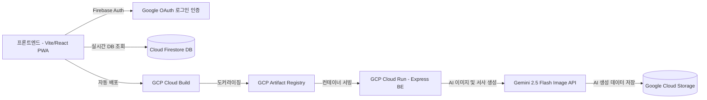

# My Monster Maker (나만의 몬스터 생성기)

> **GCP 클라우드 네이티브 아키텍처 기반 AI 몬스터 수집 및 배틀 모바일 PWA 서비스**
> 
> *본 프로젝트는 사용자가 텍스트와 외형 설정을 통해 캐릭터를 생성하고, 스탯 기반 미니게임을 거쳐 계약을 체결하며, 다른 사용자들과 비동기 턴제 전투를 진행할 수 있는 풀스택 클라우드 모바일 PWA 애플리케이션입니다.*

---

## 목차
1. [주요 게임 루프 및 서비스 흐름](#1-주요-게임-루프-및-서비스-흐름)
2. [핵심 시스템 기획 및 공식](#2-핵심-시스템-기획-및-공식)
   * [A. 스탯 기반 계약 미니게임](#a-스탯-기반-계약-미니게임)
   * [B. 실시간 비동기 턴제 전투 엔진](#b-실시간-비동기-턴제-전투-엔진)
   * [C. 스탯 등급 및 밸런스 공식 매트릭스](#c-스탯-등급-및-밸런스-공식-매트릭스)
3. [스킬 및 상태이상 상세 데이터](#3-스킬-및-상태이상-상세-데이터)
4. [시스템 아키텍처 및 CI/CD 인프라](#4-시스템-아키텍처-및-cicd-인프라)
5. [폴더 구조 (Monorepo)](#5-폴더-구조-monorepo)
6. [시작 가이드 (설치 및 실행)](#6-시작-가이드-설치-및-실행)

---

## 1. 주요 게임 루프 및 서비스 흐름


### 캐릭터 생성 파이프라인
1.  **1차 생성**: 사용자가 캐릭터 이름, 외형, 성격, 무기 정보를 텍스트로 입력합니다.
    *   **스탯 및 스킬 부여**: 입력된 정보를 분석하여 액티브 스킬 1개, 패시브 스킬 1개, 스탯 보정 특성 3개를 자동으로 구성합니다.
    *   **외형 템플릿**: 기본 외형은 제공되는 기본 템플릿 중 하나를 지정하여 보관합니다.
2.  **계약 미니게임**: 생성된 캐릭터는 미계약 상태로 5개 슬롯 중 하나에 저장되며, 스탯 기반의 미니게임을 통과해야 활성화됩니다.
3.  **2차 생성**: 계약 체결 후 전투에서 획득한 승점을 소모하여, 사용자 상세 설정이 반영된 전용 AI 이미지 및 서사 텍스트를 동적으로 생성할 수 있습니다.

---

## 2. 핵심 시스템 기획 및 공식

### A. 스탯 기반 계약 미니게임
캐릭터의 물리 수치에 따라 미니게임의 물리 공식과 기믹이 다르게 적용됩니다.
*   **체력 (HP)**: 미니게임에 진입하는 총 게이지량 (클리어 요구 조건 증가 조율)
*   **속도 (Speed)**: 판정 타이밍 바가 움직이는 속도
*   **공격력 (Atk)**: 판정 실패 시 게이지가 차감되는 패널티 감쇄량
*   **방어력 (Def)**: 판정 성공 시 게이지가 획득되는 누적 보너스량
*   **정확도 (Acc)**: Perfect 판정을 받을 수 있는 성공 판정 영역의 너비

> 계약 실패 시 1분의 재도전 대기 시간이 적용되며, 아이템 사용 시 즉시 생략이 가능합니다.

---

### B. 실시간 비동기 턴제 전투 엔진
전투는 랜덤 매칭 또는 캐릭터 고유 ID 입력을 통한 직접 배틀 방식으로 진행됩니다.

#### 1. 속도와 공격 턴 (Attack Gauge)
*   캐릭터의 속도(Speed) 스탯을 기준으로 공격 게이지가 실시간으로 축적됩니다.
*   공격 게이지가 100%에 도달하는 캐릭터가 우선권을 획득하여 행동을 취합니다.

#### 2. 명중 및 회피 판정 공식
공격 성공 여부는 아래 수식을 기준으로 판정됩니다.
$$\text{공격자 명중 롤} = \text{정확도 스탯} \times \text{Random}(0.8 \sim 1.2)$$
$$\text{방어자 회피 롤} = \text{민첩성 스탯} \times \text{Random}(0.8 \sim 1.2)$$
*   방어자 회피 롤이 공격자 명중 롤보다 높을 경우 회피(Evaded)로 판정되어 턴이 종료됩니다.
*   공격자 명중 롤이 높을 경우 명중(Hit)으로 처리되어 데미지가 계산됩니다.

#### 3. 데미지 산출 공식
$$\text{최종 피해량} = (\text{공격력 스탯} \times \text{Random}(0.9 \sim 1.1)) - (\text{방어자 방어력 스탯} \times \text{Random}(0.9 \sim 1.1))$$
*   산출된 데미지가 0 이하일 경우에도 최소 피해량 1은 보장됩니다.
*   마나가 있을 경우 액티브 스킬이 발동(MP 1 소모)되며, 조건 충족 시 패시브 효과가 적용됩니다.

#### 4. 전/후반부 전투 시스템 및 광란(Frenzy) 모드
*   전투는 전반부(30초)와 후반부(30초)로 구분됩니다. 전반부 종료 시 사용자는 제공되는 버프 선택지 중 하나를 선택하여 적용할 수 있습니다.
*   60초 경과 시점까지 승부가 나지 않으면 광란(Frenzy) 모드로 전환됩니다.
    *   광란 효과: 매 초마다 공격력, 정확도, 속도가 증가하고 방어력, 민첩성, 체력이 실시간으로 감소하여 빠르게 전투가 종결되도록 유도합니다.

---

### C. 스탯 등급 및 밸런스 공식 매트릭스

캐릭터 스탯은 E 등급부터 SS 등급까지 총 7단계로 설계되어 있습니다.

| 스텟 분류 / 등급 | E | D | C (기준) | B | A | S | SS |
| :--- | :---: | :---: | :---: | :---: | :---: | :---: | :---: |
| **핵심 스탯** *(공격/방어/민첩/정확)* | **10** | **12** | **16** | **22** | **30** | **40** | **52** |
| **체력 (HP)** | **30** | **36** | **46** | **60** | **78** | **100** | **126** |
| **속도 (Speed)** | **1** | **1.5** | **2** | **2.5** | **3** | **4** | **5** |
| **마나 (MP)** | **1** | **2** | **3** | **4** | **5** | **6** | **7** |

#### 스탯 보정 특성 메커니즘
캐릭터 생성 시 부여되는 3개의 특성은 스탯 등급에 직접 적용됩니다.
*   **일반 특성 (90% 확률)**: 특정 스탯의 세부 등급을 1단계 상승시킵니다.
*   **극단적 특성 (10% 확률)**: 특정 스탯을 3단계 상승시키는 대신, 다른 스탯을 1단계 하락시킵니다.
*   **매칭 시스템**: 캐릭터의 평균 스탯 등급을 기준으로 매칭 레이어가 구축되어, 유사한 스펙의 캐릭터 간 비동기 전투가 매칭되도록 설계되었습니다.

---

## 3. 스킬 및 상태이상 상세 데이터

### 상태이상 (Debuff Status List)
전투 중 적용되는 상태이상의 메커니즘은 다음과 같습니다.

*   **출혈 (Bleeding)**: 10초 동안 초당 1의 고정 지속 피해를 입힙니다.
*   **중독 (Poison)**: 10초 동안 피로도 및 행동 게이지 충전 패널티가 2배 증가합니다.
*   **둔화 (Slow)**: 5초 동안 속도 스탯이 50% 감소합니다.
*   **실명 (Blind)**: 다음 공격 시도 시, 명중 판정에 관여하는 정확도 수치가 50% 반감됩니다.
*   **취약 (Vulnerable)**: 다음 공격에 피격당할 때, 방어력이 50% 감소한 상태로 데미지가 계산됩니다.

### 패시브 조건부 발동 메커니즘 (Passive Conditions)
패시브 스킬은 매 틱마다 아래의 조건을 확인하여 만족 시 즉시 발동됩니다.
*   **지속형 조건**: 본인/상대 체력 비율, 전장 시간대(전/후반부), 상태이상 여부, 광란 상태 여부, 마나 고갈 여부, 특정 스탯 우위 여부 등
*   **단발형 조건**: 공격 성공/실패 시점, 방어/회피 성공/실패 시점, 특정 액티브 스킬 시전 직후 등

### 스킬 효과 분류 (Skill Effects)
*   **지속 효과**: 전투 중 영구적인 스탯 증감 효과를 부여합니다.
*   **단발 효과**: 발동 시점에 즉각적인 체력 회복, 피로도 감소, 상태이상 부여, 마나 충전, 즉시 피해 등을 적용합니다.

---

## 4. 시스템 아키텍처 및 CI/CD 인프라

`My Monster Maker`는 PWA 기술을 활용한 모바일 웹 환경과 격리된 클라우드 백엔드로 구성됩니다.



*   **Docker 기반 컨테이너화**: 백엔드는 Dockerfile을 사용하여 컨테이너 기반으로 구동됩니다.
*   **GCP CI/CD 파이프라인**: GitHub 코드 푸시 시 `GCP Cloud Build`가 트리거되어 빌드된 컨테이너가 `Artifact Registry`에 등록된 후 `Cloud Run`에 무중단 배포됩니다.
*   **PWA (Progressive Web App)**: 모바일 노치 영역 대응 디자인 및 홈 화면 추가 설치 프롬프트가 연동되어 있습니다.

---

## 5. 폴더 구조 (Monorepo)

```text
📁 my-monster-maker (Root)
├── 📄 README.md (본 문서)
│
├── 📁 frontend (Vite TS PWA Client)
│    ├── 📁 src
│    │    ├── 📁 components (PWA 탭바, 모바일 Safe Area 대응 컴포넌트)
│    │    ├── 📁 pages (Login, Create, Manage, Battle 등 게임화 화면들)
│    │    └── 📁 config (Firebase 연동 설정 파일)
│    ├── 📄 firebase.json (Firebase 배포 및 라우팅 설정)
│    └── 📄 package.json
│
└── 📁 backend (Docker/Cloud Run Server)
     ├── 📁 constants (스텟 등급 밸런스 테이블 및 상태이상 데이터)
     ├── 📄 server.js (Express API 및 Gemini 몬스터 생성 파이프라인)
     ├── 📄 cloudbuild.yaml (GCP Cloud Build 자동 배포 레시피)
     ├── 📄 Dockerfile (컨테이너 가상화 명세서)
     └── 📄 package.json
```

---

## 6. 시작 가이드 (설치 및 실행)

### 1. 환경 변수 설정
*   **백엔드 환경 설정 (`backend/.env`)**
    ```env
    PORT=8080
    GEMINI_API_KEY=your_gemini_api_key_here
    FIREBASE_SERVICE_ACCOUNT_PATH=./config/firebase-service-account.json
    GCS_BUCKET_NAME=your_gcp_storage_bucket_name
    ```

### 2. 로컬 실행 방법

#### 백엔드 서버 로컬 실행 (Node.js)
```bash
cd backend
npm install
npm start
```

#### 프론트엔드 모바일 PWA 로컬 실행 (Vite)
```bash
cd ../frontend
npm install
npm run dev
```
