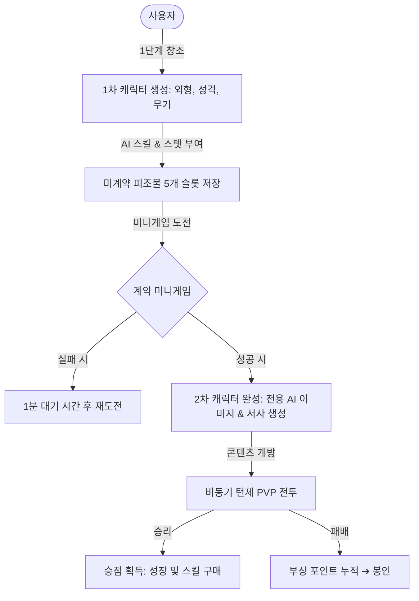
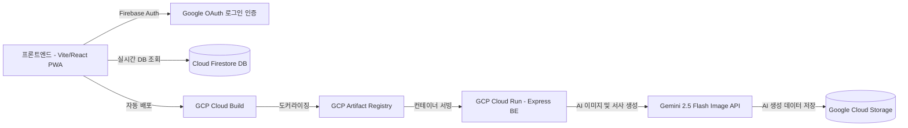

# 🐉 My Monster Maker (나만의 몬스터 생성기 - 나몬생)

> **GCP 클라우드 네이티브 아키텍처 기반 AI 몬스터 실시간 수집 및 배틀 모바일 PWA 서비스**
> 
> *본 프로젝트는 사용자가 텍스트와 외형 설정을 통해 자신만의 고유한 AI 몬스터를 창조하고, 스텟 맞춤형 미니게임을 통해 생명력을 불어넣어 계약을 맺으며, 다른 사용자들과 실시간 스텟 비교 및 동적 턴제 전투를 즐길 수 있는 풀스택 클라우드 모바일 PWA 애플리케이션입니다.*

---

## 📖 목차
1. [주요 게임 루프 및 서비스 흐름](#1-주요-게임-루프-및-서비스-흐름)
2. [핵심 시스템 기획 및 공식](#2-핵심-시스템-기획-및-공식)
   * [A. 스텟 기반 계약 미니게임](#a-스텟-기반-계약-미니게임)
   * [B. 실시간 비동기 턴제 전투 엔진](#b-실시간-비동기-턴제-전투-엔진)
   * [C. 스텟 등급 및 밸런스 공식 매트릭스](#c-스텟-등급-및-밸런스-공식-매트릭스)
3. [스킬 및 상태이상 상세 데이터](#3-스킬-및-상태이상-상세-데이터)
4. [시스템 아키텍처 및 CI/CD 인프라](#4-시스템-아키텍처-및-cicd-인프라)
5. [폴더 구조 (Monorepo)](#5-폴더-구조-monorepo)
6. [시작 가이드 (설치 및 실행)](#6-시작-가이드-설치-및-실행)

---

## 1. 주요 게임 루프 및 서비스 흐름



### 🧬 캐릭터 창조 (2단계 하이브리드 생성 파이프라인)
1.  **1차 생성 (무료 시스템)**: 사용자가 원하는 캐릭터의 이름, 외형, 성격, 사용하는 무기 등을 텍스트로 자유롭게 커스텀 입력합니다. 
    *   **AI 설계 부여**: 입력 성향을 분석해 캐릭터 맞춤형 **액티브 스킬 1개, 패시브 스킬 1개, 스텟에 관여하는 특성 3개**를 자동으로 매칭하여 부여받습니다.
    *   **외형 템플릿**: 초기 외형은 제공되는 수려한 기본 템플릿 이미지 중 하나를 매칭하여 즉시 무료 보관합니다.
2.  **계약 (Contract Mini-Game)**: 획득한 몬스터는 '미계약 피조물'로서 5개의 슬롯에 대기하며, 스텟 기반 계약 미니게임을 성공시켜야 비로소 계약이 맺어져 모든 전투 콘텐츠를 이용할 수 있게 됩니다.
3.  **2차 생성 (승점/크레딧 전용 시스템)**: 계약에 성공한 피조물은 전투를 통해 모은 '승점'을 소모하여, 입력했던 상세 설정을 반영한 **세상에 단 하나뿐인 전용 AI 이미지 렌더링 및 디테일한 비하인드 서사 이야기**를 온디맨드로 완벽하게 동적 생성해 낼 수 있습니다.

---

## 2. 핵심 시스템 기획 및 공식

### A. 스텟 기반 계약 미니게임
> **게임 방식**: 타이밍 바 업/다운 직관력 미니게임

캐릭터가 가진 신체 스텟 수치에 따라 미니게임의 물리 수치와 기믹이 완벽하게 가변 조정되는 시스템입니다. 본인의 몬스터 성향에 따라 강점이 있는 능력치를 활용해 극복하도록 설계되었습니다.
*   **체력 (HP)**: 미니게임에 진입하는 총 게이지량 (클리어 요구 조건 증가 조율)
*   **속도 (Speed)**: 판정 타이밍 바가 왔다 갔다 움직이는 물리 연산 프레임 속도
*   **공격력 (Atk)**: 타이밍 실패 시 게이지가 차감(감소)되는 패널티 감쇄량
*   **방어력 (Def)**: 타이밍 성공 시 게이지가 획득(상승)되는 누적 보너스량
*   **정확도 (Acc)**: 타이밍 바 상에서 Perfect 판정을 받을 수 있는 성공 판정 영역의 너비

> ⚠️ 계약에 실패할 경우, 1분 동안 대기 시간(Cooldown)이 적용되며, 특수 소비성 아이템을 사용하면 미니게임을 즉시 스킵할 수 있습니다.

---

### B. 실시간 비동기 턴제 전투 엔진
전투는 사용자가 등록한 몬스터를 기반으로 **랜덤 매칭** 또는 **캐릭터 고유 ID 입력 다이렉트 배틀**로 실행됩니다.

#### ⚔️ 1. 속도와 공격 턴 (Attack Gauge)
*   전투가 시작되면 매 프레임 캐릭터의 **속도(Speed)** 스텟 비례 값으로 공격 게이지가 실시간으로 축적됩니다.
*   공격 게이지가 100%에 도달하는 캐릭터가 우선권을 획득하여 단독 턴 행동을 진행합니다.

#### 🎯 2. 명중 및 회피 판정 공식
공격 턴 획득 시, 명중 여부는 다음과 같은 스텝 롤링 수치 기반의 난수 비교로 수행됩니다.
$$\text{공격자 명중 롤} = \text{정확도 스텟} \times \text{Random}(0.8 \sim 1.2)$$
$$\text{방어자 회피 롤} = \text{민첩성 스텟} \times \text{Random}(0.8 \sim 1.2)$$
*   **방어자 회피 롤이 더 높은 경우**: $\rightarrow$ **[회피(Evaded)]** 판정이 뜨며 턴이 그대로 종료됩니다.
*   **공격자 명중 롤이 더 높은 경우**: $\rightarrow$ **[명중(Hit)]** 성공으로 판단하여 데미지 판정으로 이행됩니다.

#### 💥 3. 데미지 산출 공식
$$\text{최종 피해량} = (\text{공격력 스텟} \times \text{Random}(0.9 \sim 1.1)) - (\text{방어자 방어력 스텟} \times \text{Random}(0.9 \sim 1.1))$$
*   최종 산출된 데미지가 0 이하일 경우라도 **최소 피해량 1**은 보장됩니다.
*   마나가 남아 있을 경우 액티브 스킬이 소모 값(MP 1)을 소진하며 발동되며, 조건 충족 시 상시 패시브 효과가 연쇄 적용됩니다.

#### ⏱️ 4. 2부작 전투(Halves System) 및 광란(Frenzy) 모드
*   **하프타임 선택**: 전투는 전반부(30초)와 후반부(30초)로 나뉩니다. 전반부 종료 시 사용자는 랜덤 생성되는 2개의 버프 선택지 중 하나를 동적으로 골라 캐릭터의 형세를 바꿀 수 있습니다. (전투 진행 시 쌓인 부상 수만큼 선택지의 슬롯이 늘어납니다. 원치 않을 경우 자동 전투 AI가 직접 스탯 효율 우선으로 자동 수락할 수 있습니다.)
*   **광란(Frenzy) 상태**: 총 60초가 지난 시점에도 승부가 나지 않으면, 전장은 극한의 **[광란 상태]**로 변환됩니다.
    *   *광란의 효과*: 매 초당 전장의 모든 몬스터는 **공격력, 정확도, 속도가 대폭 상승**하고, 반대로 **방어력, 민첩성, 체력이 실시간으로 감소**하여 단 한 방에 승부가 갈리는 극적인 전투 후반부를 이끌어냅니다.

---

### C. 스텟 등급 및 밸런스 공식 매트릭스

몬스터의 스텟은 총 7단계 등급(`E`부터 `SS`까지)으로 철저하게 밸런싱되어 있습니다. C등급을 중간 기준으로 하여, 세부 수치는 아래 공식 매트릭스를 완벽하게 추종합니다.

| 스텟 분류 / 등급 | E | D | C (기준) | B | A | S | SS |
| :--- | :---: | :---: | :---: | :---: | :---: | :---: | :---: |
| **비교용 핵심 수치** *(공격/방어/민첩/정확)* | **10** | **12** | **16** | **22** | **30** | **40** | **52** |
| **체력 (HP)** | **30** | **36** | **46** | **60** | **78** | **100** | **126** |
| **속도 (Speed)** | **1** | **1.5** | **2** | **2.5** | **3** | **4** | **5** |
| **마나 (MP)** | **1** | **2** | **3** | **4** | **5** | **6** | **7** |

#### 🏷️ 스텟을 결정짓는 "특성(Traits)" 메커니즘
생성 시 부여받는 3개의 특성은 각 등급에 직접적으로 관여합니다.
*   **일반 특성 (90% 확률)**: 특정 1개 스텟의 세부 등급을 **+1단계** 상승시킵니다.
*   **극단적 특성 (10% 확률)**: 양날의 검과 같은 특성으로, 특정 1개 스텟을 무려 **+3단계** 대폭 상승시키는 대신 다른 1개 스텟을 **-1단계** 하락시킵니다.
*   *매칭 시스템*: 캐릭터의 '총 등급'(모든 스텟과 스킬 등급의 평균치)을 기준으로 매칭 레이어가 구축되어, 동등한 스펙의 몬스터들과 공정하고 박진감 넘치는 매칭 전투가 유지됩니다.

---

## 3. 스킬 및 상태이상 상세 데이터

### 🔴 상태이상 (Debuff Status List)
전투 중 스킬 및 환경 요소로 적용되는 상태이상의 정밀 메커니즘 리스트입니다.

*   **🩸 출혈 (Bleeding)**: 10초 동안 **초당 1의 고정 지속 피해**를 입힙니다.
*   **🧪 중독 (Poison)**: 10초 동안 피로도 및 행동 게이지 충전 패널티가 **2배** 증가합니다.
*   **⏳ 둔화 (Slow)**: 5초 동안 캐릭터의 핵심 속도(Speed) 스텟이 **절반(50%)**으로 급감합니다.
*   **👁️ 실명 (Blind)**: 다음 공격 시도 시, 명중 판정에 관여하는 정확도(Acc) 수치가 **절반(50%)**으로 반감되어 빗나갈 확률이 폭증합니다.
*   **🛡️ 취약 (Vulnerable)**: 다음 공격에 피격당할 때, 방어력(Def)이 즉시 **50% 감쇠**된 상태로 데미지를 환산받습니다.

### 📜 패시브 조건부 발동 메커니즘 (Passive Conditions)
패시브 스킬은 매 틱마다 아래의 스레드 조건 필터를 실시간 확인하여 충족되는 순간 즉각 시전됩니다.
*   **지속용 조건 필터**: `본인/상대 체력 n% 이상·이하`, `전장 시간대가 전반부·후반부일 때`, `본인/상대가 상태이상에 걸렸을 때`, `광란 상태일 때`, `마나가 0이 되었을 때`, `특정 스텟이 상대보다 높거나 낮을 때`
*   **단발 시점 조건 필터**: `공격 성공/실패 시`, `방어/회피 성공·실패 시`, `특정 액티브 스킬을 시전한 직후`

### ✨ 스킬 효과 및 범주 (Skill Effects)
*   **지속 효과**: 전투 내내 유지되는 스텟 영구 상승 또는 특정 스텟 하락을 수반한 다른 스텟의 초극단적 강화 기법
*   **단발 효과**: 발동 시점 즉각적인 `체력(HP) 회복`, `피로도 감소`, `치명적 상태이상 부여`, `마나(MP) 보충`, `적 전체 즉시 피해 전달`

---

## 4. 시스템 아키텍처 및 CI/CD 인프라

`My Monster Maker`는 PWA 기술을 활용한 완성도 높은 모바일 배포 환경과 완벽히 격리된 클라우드 네이티브 백엔드를 지향합니다.



*   **Docker 기반 컨테이너화**: 백엔드는 Dockerfile로 정밀하게 설계되어 환경 편차 없이 완벽히 구동됩니다.
*   **GCP CI/CD 파이프라인**: 깃허브 코드 푸쉬 시 `GCP Cloud Build`가 트리거되어 자동으로 빌드된 컨테이너가 `Artifact Registry`를 거쳐 `Cloud Run`에 무중단 롤링 배포되도록 자동화되어 있습니다.
*   **PWA (Progressive Web App)**: 모바일 노치(Notch) 영역 대응 디자인과 홈 화면 추가 프롬프트(`PWAInstallPrompt`)가 완벽 연동되어 있습니다.

---

## 5. 폴더 구조 (Monorepo)

```text
📁 my-monster-maker (Root)
├── 📄 README.md (본 문서)
│
├── 📁 frontend (Vite TS PWA Client)
│    ├── 📁 src
│    │    ├── 📁 components (PWA 탭바, 모바일 Safe Area 대응 컴포넌트)
│    │    ├── 📁 pages (Login, Create, Manage, Battle 등 게임화 화면들)
│    │    └── 📁 config (Firebase 연동 설정 파일)
│    ├── 📄 firebase.json (Firebase 배포 및 라우팅 설정)
│    └── 📄 package.json
│
└── 📁 backend (Docker/Cloud Run Server)
     ├── 📁 constants (스텟 등급 밸런스 테이블 및 상태이상 데이터)
     ├── 📄 server.js (Express API 및 Gemini 몬스터 생성 파이프라인)
     ├── 📄 cloudbuild.yaml (GCP Cloud Build 자동 배포 레시피)
     ├── 📄 Dockerfile (컨테이너 가상화 명세서)
     └── 📄 package.json
```

---

## 6. 시작 가이드 (설치 및 실행)

### 🔑 1. 환경 변수 설정
*   **백엔드 환경 설정 (`backend/.env`)**
    ```env
    PORT=8080
    GEMINI_API_KEY=your_gemini_api_key_here
    FIREBASE_SERVICE_ACCOUNT_PATH=./config/firebase-service-account.json
    GCS_BUCKET_NAME=your_gcp_storage_bucket_name
    ```

### ⚙️ 2. 로컬 실행 방법

#### 백엔드 서버 로컬 실행 (Node.js)
```bash
cd backend
npm install
npm start
```

#### 프론트엔드 모바일 PWA 로컬 실행 (Vite)
```bash
cd ../frontend
npm install
npm run dev
```
